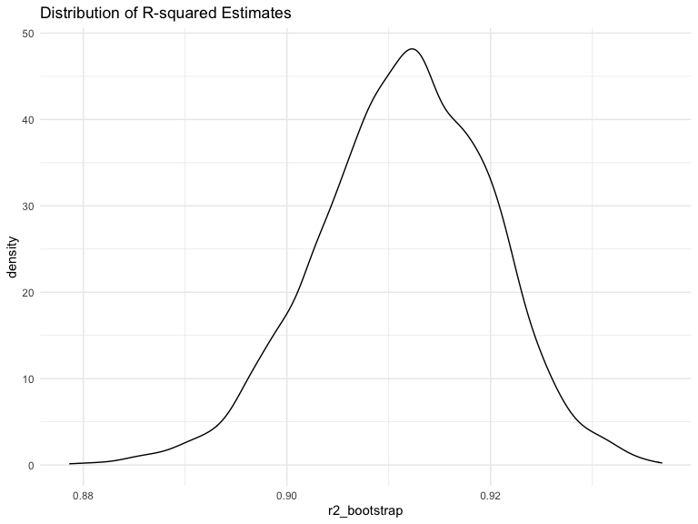
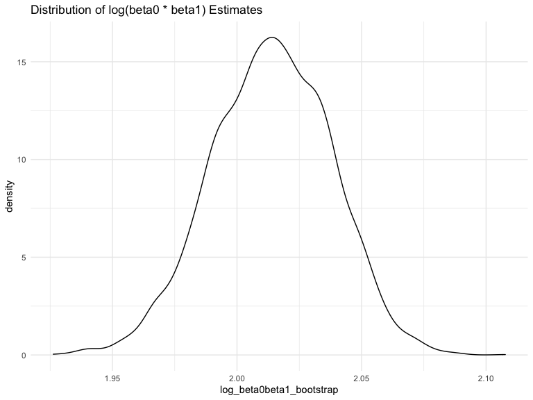

p8105_hw6_mwd2126.Rmd
================
Michael Denham
2022-12-03

### Problem 1

To perform a bootstrap for linear regression with `tmax` as the response
variable and `tmin` as the predictor variable, we can use the following
code. First, we download the weather data.

``` r
weather_df = 
  rnoaa::meteo_pull_monitors(
    c("USW00094728"),
    var = c("PRCP", "TMIN", "TMAX"), 
    date_min = "2017-01-01",
    date_max = "2017-12-31") %>%
  mutate(
    name = recode(id, USW00094728 = "CentralPark_NY"),
    tmin = tmin / 10,
    tmax = tmax / 10) %>%
  select(name, id, everything())
```

    ## using cached file: ~/Library/Caches/R/noaa_ghcnd/USW00094728.dly

    ## date created (size, mb): 2022-12-04 09:11:51 (8.428)

    ## file min/max dates: 1869-01-01 / 2022-12-31

Then, we set the number of bootstrap samples and make empty vectors to
store the bootstrap estimates.

``` r
n_bootstrap = 5000
r2_bootstrap = numeric(n_bootstrap)
log_beta0beta1_bootstrap = numeric(n_bootstrap)
```

Then we bootstrap sampling.

``` r
for (i in 1:n_bootstrap){

  #Sample with replacement from the original data
  bootstrap_sample = sample(1:nrow(weather_df), replace = TRUE)
  
  #Fit a linear regression model on the bootstrap sample
  bootstrap_model = lm(tmax ~ tmin, data = weather_df[bootstrap_sample, ])
  
  #Extract r2 and log(beta0 * beta1) from the bootstrap model
  r2_bootstrap[i] = broom::glance(bootstrap_model)$r.squared
  log_beta0beta1_bootstrap[i] = log(coef(bootstrap_model)[1] * coef(bootstrap_model)[2])
  
}
```

Then we plot the distribution of our bootstrap estimates.

``` r
#For r2_bootstrap
r2_bootstrap %>%
  data.frame() %>% 
  ggplot(aes(x = r2_bootstrap)) +
  geom_density() +
  labs(
    title = "Distribution of R-squared Estimates"
  )
```



``` r
#For log_beta0beta1_bootstrap
log_beta0beta1_bootstrap %>%
  data.frame() %>% 
  ggplot(aes(x = log_beta0beta1_bootstrap)) +
  geom_density() +
  labs(
    title = "Distribution of log(beta0 * beta1) Estimates"
  )
```



The resulting plots show the distribution of r2 and log(beta0 \* beta1)
estimates obtained from the bootstrap samples. They show that the value
of `r2_bootstrap` is generally around 0.91 and the value of
`log_beta0beta1_bootstrap` is generally around 2.01.

Now, we calculate 95% confidence intervals for r2 and log(beta0 \*
beta1). The 95% confidence intervals for these two quantities can be
calculated by taking the 2.5% and 97.5% quantiles of the bootstrap
estimates.

``` r
r2_ci = quantile(r2_bootstrap, c(0.025, 0.975))

log_beta0beta1_ci = quantile(log_beta0beta1_bootstrap, c(0.025, 0.975))
```

In this case, the 95% confidence interval for `r2_bootstrap` is
\[0.89372,0.92696\] and the 95% confidence interval for
`log_beta0beta1_bootstrap` is \[1.96312,2.06034\].

### Problem 2

### Problem 3
