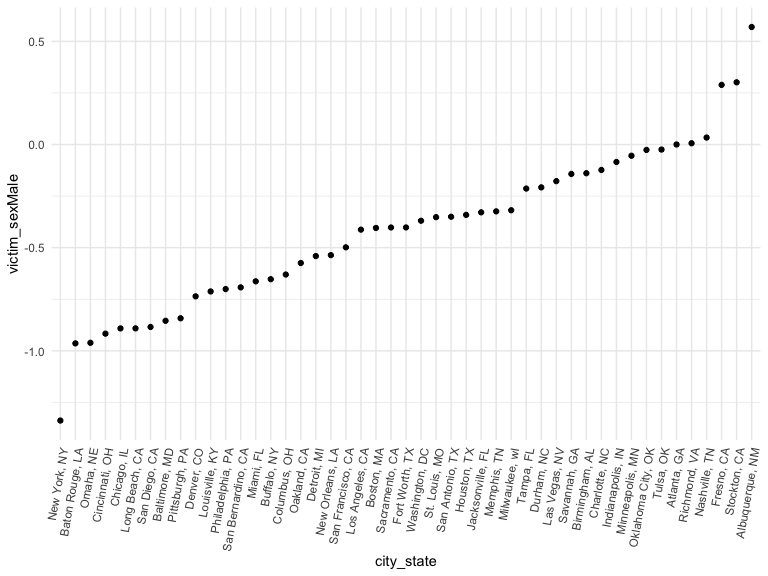
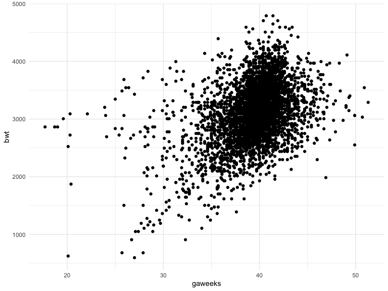

p8105_hw6_mwd2126.Rmd
================
Michael Denham
2022-12-03

### Problem 1

To perform a bootstrap for linear regression with `tmax` as the response
variable and `tmin` as the predictor variable, we can use the following
code. First, we download the weather data.

``` r
weather_df = 
  rnoaa::meteo_pull_monitors(
    c("USW00094728"),
    var = c("PRCP", "TMIN", "TMAX"), 
    date_min = "2017-01-01",
    date_max = "2017-12-31") %>%
  mutate(
    name = recode(id, USW00094728 = "CentralPark_NY"),
    tmin = tmin / 10,
    tmax = tmax / 10) %>%
  select(name, id, everything())
```

    ## using cached file: ~/Library/Caches/R/noaa_ghcnd/USW00094728.dly

    ## date created (size, mb): 2022-12-04 09:11:51 (8.428)

    ## file min/max dates: 1869-01-01 / 2022-12-31

Then, we set the number of bootstrap samples and make empty vectors to
store the bootstrap estimates.

``` r
n_bootstrap = 5000
r2_bootstrap = numeric(n_bootstrap)
log_beta0beta1_bootstrap = numeric(n_bootstrap)
```

Then we start bootstrap sampling.

``` r
for (i in 1:n_bootstrap){

  #Sample with replacement from the original data
  bootstrap_sample = sample(1:nrow(weather_df), replace = TRUE)
  
  #Fit a linear regression model on the bootstrap sample
  bootstrap_model = lm(tmax ~ tmin, data = weather_df[bootstrap_sample, ])
  
  #Extract r2 and log(beta0 * beta1) from the bootstrap model
  r2_bootstrap[i] = broom::glance(bootstrap_model)$r.squared
  log_beta0beta1_bootstrap[i] = log(coef(bootstrap_model)[1] * coef(bootstrap_model)[2])
  
}
```

Then we plot the distribution of our bootstrap estimates.

``` r
#For r2_bootstrap
r2_bootstrap %>%
  data.frame() %>% 
  ggplot(aes(x = r2_bootstrap)) +
  geom_density() +
  labs(
    title = "Distribution of R-squared Estimates"
  )
```


``` r
#For log_beta0beta1_bootstrap
log_beta0beta1_bootstrap %>%
  data.frame() %>% 
  ggplot(aes(x = log_beta0beta1_bootstrap)) +
  geom_density() +
  labs(
    title = "Distribution of log(beta0 * beta1) Estimates"
  )
```


The resulting plots show the distribution of r2 and log(beta0 \* beta1)
estimates obtained from the bootstrap samples. They show that the value
of `r2_bootstrap` is generally around 0.91 and the value of
`log_beta0beta1_bootstrap` is generally around 2.01.

Now, we calculate 95% confidence intervals for r2 and log(beta0 \*
beta1). The 95% confidence intervals for these two quantities can be
calculated by taking the 2.5% and 97.5% quantiles of the bootstrap
estimates.

``` r
r2_ci = quantile(r2_bootstrap, c(0.025, 0.975))
log_beta0beta1_ci = quantile(log_beta0beta1_bootstrap, c(0.025, 0.975))
```

In this case, the 95% confidence interval for `r2_bootstrap` is \[0.894,
0.927\] and the 95% confidence interval for `log_beta0beta1_bootstrap`
is \[1.966, 2.059\].

### Problem 2

First, we’ll start by importing the data from the Washington Post’s
Github page.

``` r
homicide <- read.csv("https://raw.githubusercontent.com/washingtonpost/data-homicides/master/homicide-data.csv")
```

We can then create the `city_state` variable by combining the city and
state columns, and create the binary variable `solved` indicating
whether the homicide is solved by using the `ifelse()` function to
assign 1 to homicides that are solved and 0 to those that are not.

``` r
homicide = homicide %>% 
  mutate(
    city_state = str_c(city, ", ", state),
    resolved = ifelse(homicide$disposition == "Closed by arrest", 1, 0)
  )
```

Then we’ll remove Dallas, TX; Phoenix, AZ; and Kansas City, MO because
they don’t report victim race and omit Tulsa, AL because this is a data
entry mistake. We’ll also remove any rows where the victim wasn’t white
or black and make sure the victim’s age is numeric.

``` r
homicide = homicide %>% 
  filter(city_state != "Dallas, TX" && city_state != "Phoenix, AZ" && city_state != "Kansas City, MO") %>%
  filter(city_state != "Tulsa, AL") %>% 
  filter(victim_race == "White" | victim_race == "Black") %>% 
  filter(victim_age != "Unknown") %>% 
  filter(victim_sex != "Unknown")

homicide$victim_age = as.numeric(homicide$victim_age)
```

We’ll make a data frame including only victims in Baltimore, selecting
for the variables we’ll need in our subsequent analysis. Then, we’ll run
a generalized linear regression with resolved vs unresolved as the
outcome and victim age, sex and race as predictors.

``` r
baltimore = homicide %>% 
  filter(city_state == "Baltimore, MD") %>% 
  select(resolved, victim_age, victim_sex, victim_race)

fit_logistic = 
  baltimore %>% 
  glm(resolved ~ victim_age + victim_sex + victim_race , data = ., family = binomial())

fit_logistic = fit_logistic %>%
  broom::tidy() %>%
  mutate(OR = exp(estimate)) %>%
  select(term, log_OR = estimate, OR, p.value) %>% 
  knitr::kable(digits = 3) %>% 
  print()
```

    ## 
    ## 
    ## |term             | log_OR|    OR| p.value|
    ## |:----------------|------:|-----:|-------:|
    ## |(Intercept)      |  0.310| 1.363|   0.070|
    ## |victim_age       | -0.007| 0.993|   0.043|
    ## |victim_sexMale   | -0.854| 0.426|   0.000|
    ## |victim_raceWhite |  0.842| 2.320|   0.000|

The adjusted odds ratio for solving homicides comparing male victims to
female victims keeping all other variables fixed is 0.426, with a
confidence interval of \[0.564, 0.288\], suggesting that in Baltimore
homicides with male victims are less likely to be solved compared to
those with female victims.

Now, we’ll repeat this analysis for all the cities involved. We’ll make
a function and then map that function to all cities.

``` r
city_state_list = unique(homicide$city_state)

homicide_city <- function(location) {
  df = homicide %>% 
    filter(city_state == location) %>%
    select(resolved, victim_age, victim_sex, victim_race)
  return(df)
}

city_state_dfs = map(city_state_list, homicide_city)

nest_city_homicides =
  homicide %>% 
  nest(data = -city_state) %>% 
  mutate(
    models = map(data, ~ glm(resolved ~ victim_age + victim_sex + victim_race, data = .x, family = binomial())),
    results = map(models, broom::tidy, conf.int = TRUE, conf.level = 0.95)) %>% 
  select(-data, -models) %>% 
  unnest(results)
```

Now we’ll neaten that information in a table.

``` r
nest_city_homicides %>% 
  select(city_state, term, estimate) %>% 
  mutate(term = fct_inorder(term)) %>% 
  pivot_wider(
    names_from = term, values_from = estimate) %>% 
  knitr::kable(digits = 3)
```

| city_state         | (Intercept) | victim_age | victim_sexMale | victim_raceWhite |
|:-------------------|------------:|-----------:|---------------:|-----------------:|
| Albuquerque, NM    |       0.612 |     -0.020 |          0.570 |            0.412 |
| Atlanta, GA        |       0.869 |     -0.012 |          0.000 |            0.269 |
| Baltimore, MD      |       0.310 |     -0.007 |         -0.854 |            0.842 |
| Baton Rouge, LA    |       1.139 |     -0.007 |         -0.964 |            0.447 |
| Birmingham, AL     |       0.682 |     -0.008 |         -0.139 |           -0.068 |
| Boston, MA         |       0.138 |     -0.004 |         -0.404 |            2.365 |
| Buffalo, NY        |      -0.506 |      0.014 |         -0.653 |            0.960 |
| Charlotte, NC      |       1.065 |     -0.001 |         -0.123 |            0.460 |
| Chicago, IL        |      -0.489 |      0.007 |         -0.891 |            0.575 |
| Cincinnati, OH     |       1.229 |     -0.010 |         -0.917 |            1.136 |
| Columbus, OH       |       0.157 |      0.007 |         -0.630 |            0.164 |
| Denver, CO         |       0.695 |     -0.014 |         -0.736 |            0.572 |
| Detroit, MI        |      -0.038 |      0.003 |         -0.541 |            0.427 |
| Durham, NC         |       0.920 |     -0.004 |         -0.208 |           -0.023 |
| Fort Worth, TX     |       1.213 |     -0.021 |         -0.402 |            0.063 |
| Fresno, CA         |      -0.132 |      0.012 |          0.289 |            0.777 |
| Houston, TX        |       0.609 |     -0.009 |         -0.341 |            0.060 |
| Indianapolis, IN   |       0.383 |     -0.009 |         -0.085 |            0.709 |
| Jacksonville, FL   |       0.312 |     -0.007 |         -0.329 |            0.437 |
| Las Vegas, NV      |       0.776 |     -0.007 |         -0.178 |            0.252 |
| Long Beach, CA     |       1.091 |      0.009 |         -0.891 |           -0.048 |
| Los Angeles, CA    |       0.380 |     -0.003 |         -0.413 |            0.548 |
| Louisville, KY     |       0.804 |     -0.009 |         -0.712 |            0.919 |
| Memphis, TN        |       1.566 |     -0.016 |         -0.324 |            0.217 |
| Miami, FL          |      -0.184 |     -0.001 |         -0.663 |            0.544 |
| Milwaukee, wI      |       1.116 |     -0.012 |         -0.319 |            0.521 |
| Minneapolis, MN    |      -0.220 |      0.005 |         -0.054 |            0.496 |
| Nashville, TN      |       0.586 |     -0.004 |          0.034 |            0.140 |
| New Orleans, LA    |       0.451 |     -0.022 |         -0.536 |            0.807 |
| New York, NY       |       1.078 |      0.008 |         -1.338 |            0.796 |
| Oakland, CA        |       0.115 |      0.001 |         -0.574 |            1.710 |
| Oklahoma City, OK  |       0.259 |     -0.008 |         -0.026 |            0.359 |
| Omaha, NE          |       0.361 |      0.004 |         -0.961 |            1.989 |
| Philadelphia, PA   |       0.775 |      0.001 |         -0.701 |            0.436 |
| Pittsburgh, PA     |       0.283 |      0.005 |         -0.842 |            1.275 |
| Richmond, VA       |       1.373 |     -0.016 |          0.006 |            0.700 |
| San Antonio, TX    |       1.059 |     -0.014 |         -0.350 |            0.294 |
| Sacramento, CA     |       0.554 |      0.007 |         -0.402 |            0.269 |
| Savannah, GA       |       0.062 |      0.001 |         -0.143 |            0.535 |
| San Bernardino, CA |      -0.584 |      0.020 |         -0.692 |            0.013 |
| San Diego, CA      |       1.210 |     -0.005 |         -0.884 |            0.720 |
| San Francisco, CA  |      -0.723 |      0.027 |         -0.498 |            0.866 |
| St. Louis, MO      |       0.245 |     -0.005 |         -0.352 |            0.552 |
| Stockton, CA       |      -0.616 |      0.001 |          0.301 |            0.802 |
| Tampa, FL          |       0.466 |      0.000 |         -0.214 |           -0.212 |
| Tulsa, OK          |       0.824 |     -0.009 |         -0.025 |            0.526 |
| Washington, DC     |       0.771 |     -0.007 |         -0.370 |            0.652 |

Now we’ll narrow in on the ORs and CIs for the impact of the victim’s
sex specifically.

``` r
sex_hom = nest_city_homicides %>% 
  select(city_state, term, estimate, conf.low, conf.high) %>% 
  mutate(term = fct_inorder(term)) %>% 
  pivot_wider(
    names_from = term, values_from = estimate) %>%
  drop_na(victim_sexMale) %>%
  select(city_state, victim_sexMale, conf.low, conf.high) 

sex_hom %>% 
  knitr::kable(digits = 3)
```

| city_state         | victim_sexMale | conf.low | conf.high |
|:-------------------|---------------:|---------:|----------:|
| Albuquerque, NM    |          0.570 |   -0.193 |     1.325 |
| Atlanta, GA        |          0.000 |   -0.385 |     0.377 |
| Baltimore, MD      |         -0.854 |   -1.126 |    -0.584 |
| Baton Rouge, LA    |         -0.964 |   -1.588 |    -0.380 |
| Birmingham, AL     |         -0.139 |   -0.560 |     0.273 |
| Boston, MA         |         -0.404 |   -1.047 |     0.231 |
| Buffalo, NY        |         -0.653 |   -1.243 |    -0.066 |
| Charlotte, NC      |         -0.123 |   -0.596 |     0.330 |
| Chicago, IL        |         -0.891 |   -1.090 |    -0.691 |
| Cincinnati, OH     |         -0.917 |   -1.464 |    -0.405 |
| Columbus, OH       |         -0.630 |   -0.975 |    -0.290 |
| Denver, CO         |         -0.736 |   -1.458 |    -0.038 |
| Detroit, MI        |         -0.541 |   -0.772 |    -0.310 |
| Durham, NC         |         -0.208 |   -0.961 |     0.506 |
| Fort Worth, TX     |         -0.402 |   -0.933 |     0.114 |
| Fresno, CA         |          0.289 |   -0.567 |     1.114 |
| Houston, TX        |         -0.341 |   -0.585 |    -0.099 |
| Indianapolis, IN   |         -0.085 |   -0.388 |     0.216 |
| Jacksonville, FL   |         -0.329 |   -0.624 |    -0.036 |
| Las Vegas, NV      |         -0.178 |   -0.501 |     0.141 |
| Long Beach, CA     |         -0.891 |   -1.947 |     0.024 |
| Los Angeles, CA    |         -0.413 |   -0.784 |    -0.047 |
| Louisville, KY     |         -0.712 |   -1.199 |    -0.244 |
| Memphis, TN        |         -0.324 |   -0.642 |    -0.017 |
| Miami, FL          |         -0.663 |   -1.191 |    -0.135 |
| Milwaukee, wI      |         -0.319 |   -0.703 |     0.053 |
| Minneapolis, MN    |         -0.054 |   -0.743 |     0.632 |
| Nashville, TN      |          0.034 |   -0.385 |     0.442 |
| New Orleans, LA    |         -0.536 |   -0.863 |    -0.208 |
| New York, NY       |         -1.338 |   -2.019 |    -0.724 |
| Oakland, CA        |         -0.574 |   -1.011 |    -0.143 |
| Oklahoma City, OK  |         -0.026 |   -0.473 |     0.419 |
| Omaha, NE          |         -0.961 |   -1.615 |    -0.341 |
| Philadelphia, PA   |         -0.701 |   -0.978 |    -0.431 |
| Pittsburgh, PA     |         -0.842 |   -1.337 |    -0.363 |
| Richmond, VA       |          0.006 |   -0.727 |     0.690 |
| San Antonio, TX    |         -0.350 |   -0.934 |     0.214 |
| Sacramento, CA     |         -0.402 |   -1.120 |     0.273 |
| Savannah, GA       |         -0.143 |   -0.871 |     0.577 |
| San Bernardino, CA |         -0.692 |   -1.799 |     0.380 |
| San Diego, CA      |         -0.884 |   -1.654 |    -0.186 |
| San Francisco, CA  |         -0.498 |   -1.166 |     0.144 |
| St. Louis, MO      |         -0.352 |   -0.635 |    -0.071 |
| Stockton, CA       |          0.301 |   -0.469 |     1.097 |
| Tampa, FL          |         -0.214 |   -1.080 |     0.621 |
| Tulsa, OK          |         -0.025 |   -0.496 |     0.434 |
| Washington, DC     |         -0.370 |   -0.764 |     0.013 |

And we’ll plot it.

``` r
sex_hom %>%
  mutate(city_state = fct_reorder(city_state, victim_sexMale)) %>% 
  ggplot(aes(x = city_state, y = victim_sexMale)) + 
  geom_point() +
  theme(axis.text.x = element_text(angle = 80, hjust = 1))
```


The plot might suggest that bigger cities seem to have a lower odds
ratio. Notably, the odds ratio NYC is much lower than all the other
cities included in this analysis.

### Problem 3

Load the data first.

``` r
bw <- read.csv("https://p8105.com/data/birthweight.csv")
```

Now we’ll clean it up a bit.

``` r
bw = bw %>% 
  drop_na() %>% 
  mutate(babysex = factor(if_else(babysex == 1, "male", "female")),
         frace = factor(recode(frace, '1' = "White", '2' = "Black", '3' = "Asian", '4' = "Puerto Rican", '8' = "Other", '9' = "Unknown")),
         malform = factor(if_else(malform == 1, "present", "absent")),
         mrace = factor(recode(mrace,'1' = "White", '2' = "Black", '3' = "Asian", '4' = "Puerto Rican", '8' = "Other", '9' = "Unknown")))
```

I’d like to use gestational age as a possible predictor for birth
weight, since weight changes across gestation and prematurity can lead
to lower birth weights. We’ll also include mother’s age as a covariate,
as that can impact fetal development.

``` r
fit = lm(bwt ~ gaweeks + momage, data = bw)

fit %>% 
ggplot(aes(x = gaweeks, y = bwt)) + 
  geom_point()
```


